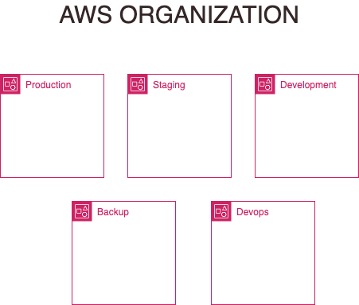

# AWS Design

## Organization

We are going to implement aws using some good practices implementation.
First we are going to implement:

- organization
- Control Tower
- Add 3 new accounts
  - Production
  - Staging
  - Development
  - Devops
  - Backup
- Add the default features like accounts for audit, logs

#TODO In 13/12/2023 i didnt decide how im going to implement that, with terraform, ansible, cloudformation or cdk.
